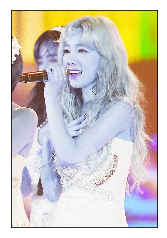
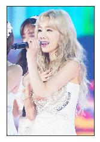

### Open CV Tutorial


####  참고사이트 

#### 	- [옥수별님 블로그](https://blog.naver.com/samsjang/220498694383)
#### 	- [한글 Document](https://opencv-python.readthedocs.io/en/latest/doc/02.videoStart/videoStart.html)
#### 	-[영문 Document](https://opencv-python-tutroals.readthedocs.io/en/latest/py_tutorials/py_gui/py_image_display/py_image_display.html#additional-resources)


## IMAGE


```python
import cv2
```


```python
imgfile = 'C:/Users/Kim/Desktop/boaz_mentoring/OpenCV/model.png'
```

### Read an image
- cv2.imread(이미지 파일 경로, 이미지 파일 읽는 방식)

    - cv2.IMREAD_COLOR : 컬러 이미지로 로드/ 이미지의 투명한 부부은 모두 무시, 디폴트 값(1)
    - cv2.IMREAD_GRAYSCALE : 흑백 이미지로 로드(0)
    - cv2.IMREAD_UNCHANGED : 알파채널을 포함하여 이미지를 그대로 로드함 (-1)


```python
#Load an color image in grayscale
img = cv2.imread(imgfile,0)
```

- Display an image
    - cv2.imshow(창이름, 화면에 표시할 이미지 객체) : 이미지를 화면에 나타내는 함수
    - cv2.waitKey() : 지정 된 시간 동안 키보드 입력을 기다리는 함수(1/1000초). 0의 의미는 키보드 입력을 기다립니다.return 값은 키보드 값
    - cv2.destroyAllWindows() : 생성한 모든 윈도우 제거      
                   
      ​                 


```python
cv2.imshow('image',img)
cv2.waitKey(0)
cv2.destroyAllWindows()
```

   - 창이 미리 띄워져있고 하나 더 띄울려하고 할 때
      창의 크기를 조정을 가능한 것과 불가능 한 것으로 나눌 수 있다.
        - cv2.namedWindow(화면에 표시할 이미지 객체, 설정값)
            - cv2.WINDOW_AUTOSIZE : 기본 값
            - cv2.WINDOW_NORMAL : 창의 크기를 조절 할 수 있음


```python
cv2.namedWindow('image', cv2.WINDOW_NORMAL)
cv2.imshow('image',img)
cv2.waitKey(0)
cv2.destroyAllWindows()
```

### Write an image : image을 저장 
   - cv2.imwrite('messigray.png',img)
        - 'messigray.png' : 저장할려고 하는 이름
        - img : 저장할려고하는 이미지


```python
cv2.imwrite('modelgray.png',img)
```


## Sum it up
1. Below program loads an image in grayscale, displays it
2. save the image if you press ‘s’ and exit, or simply exit without saving if you press ESC key.


```python
def showimage_grayscale():
    imgfile = 'C:/Users/Kim/Desktop/boaz_mentoring/OpenCV/model.png'
    img = cv2.imread(imgfile,0)
    cv2.imshow('image',img)
    a = cv2.waitKey(0)
    if a == 27 :               #wait for ESC key to exit
        cv2.destroyAllWindows()
    elif a == ord('s'): # wait for 's' key to save and exit
        cv2.imwrite('model_save.png',img)
        cv2.destroyAllWindows()
```


```python
showimage_grayscale()
```


```python
import numpy as np
from matplotlib import pyplot as plt
```


```python
img = cv2.imread(imgfile,cv2.IMREAD_COLOR)
plt.imshow(img)
plt.xticks([]) # x축 눈금
plt.yticks([]) # y축 눈금
plt.show()
```





    - OpenCV같은 경우 BGR을 사용 하지만 Mathplotlib은 RGB로 이미지를 보여줌
    - 결과 값은 3차원 배열의 값 중 첫번째와 세번째 배열 값을 바꿔줘야한다.


```python
img = cv2.imread(imgfile, cv2.IMREAD_COLOR)

b, g, r = cv2.split(img)   # img파일을 b,g,r로 분리

plt.imshow(r) #r로만 표현된 파일
plt.xticks([]) # x축 눈금 없이
plt.yticks([]) # y축 눈금 없이
plt.show()
```


```python
img = cv2.imread(imgfile, cv2.IMREAD_COLOR)

b, g, r = cv2.split(img)   # img파일을 b,g,r로 분리
img2 = cv2.merge([r,g,b]) # b, r을 바꿔서 Merge

plt.imshow(img2)
plt.xticks([]) # x축 눈금 없이
plt.yticks([]) # y축 눈금 없이
plt.show()
```




-----------------

## Video

1. cap = cv2.VideoCapture(0)
    - 비디오 캡쳐를 위해 VideoCaputre 객체를 생성 
    - 인자로 장치 인덱스, 비디오 파일을 지정
    - 웹캠이 두개 이상 있을시, 첫번째 웹캠은 0 두번째는 1등으로 지정
    - 저장되어 있는 비디오 파일을 이용 시 비디오 파일 이름을 지정하면된다.
    - ex) cv2,VideoCapture('video.mp4')
    
2. while(True):
    ret, frame = cap.read() 
    - 라이브로 들어오는 비디오를 frame을 while문 loop을 돌면서 읽어들입니다
    - ret : frame capture 결과(boolean: T/F)
    - frame : 캡쳐한 frame
3. cap.release()
    - 영상 재생이 끝나면, VideoCapure Object를 해제(필수)
4. cap.get(), cap.set()
    - 비디오와 관련된 다양한 속성 값을 취할 수 있음
    - cap.get(3) 결과 값은 폭, cap.get(4) 결과 값은 높이
    - ret = cap.set(3,320) : 새로운 폭 설정 320으로 바꿔주기
5. cap.isOpen(0), cap.open(0)
    - cap.isOpened() : cap이 정상적으로 open 되었는지 확인 
    - False면 cap.open(0)통해서 오픈


```python
import numpy as np
import cv2

cap = cv2.VideoCapture(0)

# 320*240으로 설정
cap.set(3,320)
cap.set(4,240)


while(True):
    ret, frame = cap.read()

    # Our operations on the frame come here
    RGB2LUV = cv2.cvtColor(frame, cv2.COLOR_RGB2LUV)
    #cv2.COLOR_  : conver color to something you want

    # Display the resulting frame
    cv2.imshow('frame',RGB2LUV)
    if cv2.waitKey(1) & 0xFF == ord('q'):   # 64bit OS의 경우 & 0xFF로 bit연산을 수행해야 합니다.
        break

# When everything done, release the capture
cap.release()
cv2.destroyAllWindows()
```


## Trouble Shooting

    - cv2.imwrite('model_save',img) to cv2.imwrite('model_save.png',img)
